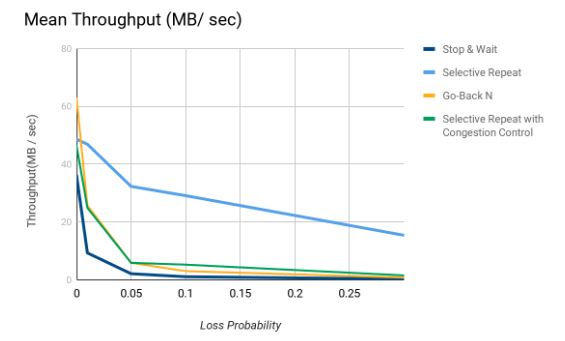
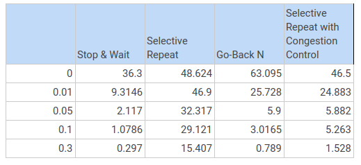
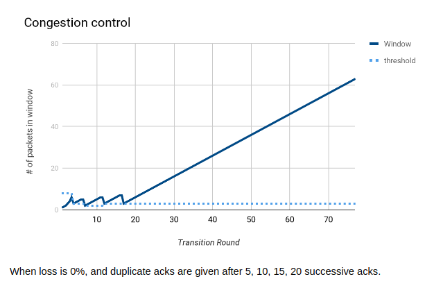

# Overview

1. Implementation of a reliable data transfer service using UDP sockets.
2. Simulate packet loss since there is a small probability of packet loss to check our results.
3. Implement 4 techniques for reliable data transfer : wait & stop, go-back n, selective repeat and selective repeat with congestion control.

---
# Client Assumptions
1. Client should always ask for existing files or else will wait for a response which won’t arrive(and will timeout in 60 second).
2. Client will write packets to the file in order as soon as possible to not use a buffer to keep them in.

---
# Server Assumptions
1. Congestion control file is assumed to have the name ‘control.cc’ and to be in the server directory.
2. Output the transmission graph for congestion control in a file named ‘trans_rounds.cc’.
3. Timeout is given as 1 millisecond.
4. Packet data size is 512 byte.
5. Handles multiple concurrent clients.
6. Uses 16-bit checksum to check for bit errors.

---
# Arguments for the client

The client is to be provided with an input file client.in from which it reads the following
information, in the order shown, one item per line :
```
IP address of server.
Well-known port number of server.
Port number of client.
Filename to be transferred (should be a large file).
Initial receiving sliding-window size (in datagram units).
```
---
# Arguments for the server

You should provide the server with an input file server.in from which it reads the following
information, in the order shown, one item per line :
```
Well-known port number for server.
Maximum sending sliding-window size (in datagram units).
Random generator seed value.
Probability p of datagram loss
(real number in the range [ 0.0 , 1.0 ]).
```
---
# Arguments for control.cc

The format of the file would be:
```
N0
N1
.
.
Nn
```
where each Ni is the number of packets sent before we simulate a triple ack.

---
### Evaluation

Performance Evaluation :




Example of a congestion control plot :




